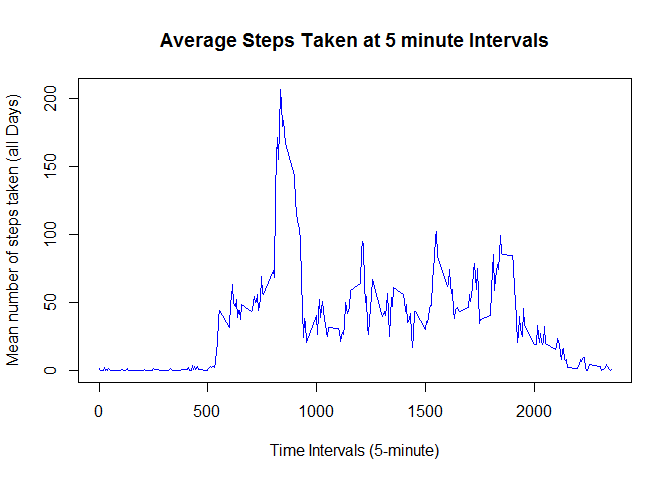
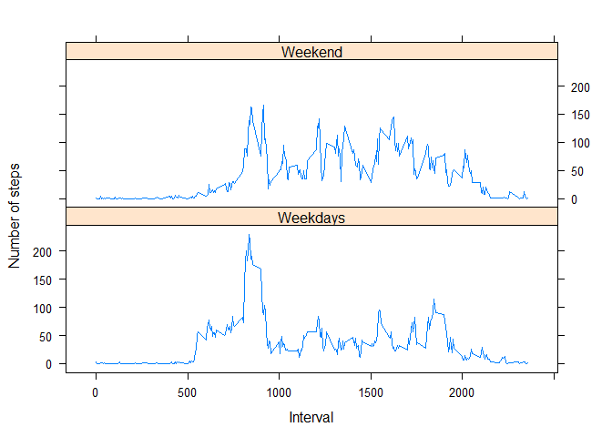

## Loading and preprocessing the data

```r
unzip(zipfile = "activity.zip")

MyData <- read.csv("activity.csv")

MyData$date <- as.Date(MyData$date, "%Y-%m-%d")
```
## What is mean total number of steps taken per day?

```r
library(ggplot2)
TotSteps<-tapply(MyData$steps, MyData$date, FUN = sum, na.rm = TRUE)
qplot(TotSteps, binwidth = 1000, xlab = "total number of steps taken each day")
```

<!-- -->

```r
mean(TotSteps, na.rm = TRUE)
```

```
## [1] 9354.23
```

```r
median(TotSteps, na.rm = TRUE)
```

```
## [1] 10395
```


## What is the average daily activity pattern?

```r
interval<-MyData$interval
steps<-MyData$steps

average <- tapply(MyData$steps, MyData$interval, mean, na.rm = TRUE)
plot(row.names(average), average, type = "l", xlab = "Time Intervals (5-minute)", ylab = "Mean number of steps taken (all Days)", main = "Average Steps Taken at 5 minute Intervals", col = "blue")
```

<!-- -->

## Imputing missing values

```r
TotNAVal <- sum(is.na(MyData))
TotNAVal
```

```
## [1] 2304
```

```r
na_indices <- which(is.na(MyData))
imputed_values<-average[as.character(MyData[na_indices, 3])]
names(imputed_values) <- na_indices

for (i in na_indices) {
    MyData$steps[i] = imputed_values[as.character(i)]
}
sum(is.na(MyData))
```

```
## [1] 0
```

```r
TotSteps <- tapply(MyData$steps, MyData$date, sum)
hist(TotSteps, col = "red", xlab = "Total Steps per Day", ylab = "Frequency", main = "Histogram of Total Steps taken per day")
```

<!-- -->
## Are there differences in activity patterns between weekdays and weekends?

```r
library(lattice)
days<-weekdays(MyData$date)
MyData$Day_type <- ifelse(days == "Saturday" | days == "Sunday", "Weekend", "Weekdays")
meansteps <- aggregate(MyData$steps, by = list(MyData$interval, MyData$Day_type), mean)
names(meansteps) <- c("interval", "Day_type", "steps")

xyplot(steps ~ interval | Day_type, meansteps, type = "l", layout = c(1, 2), xlab = "Interval", ylab = "Number of steps")
```

<!-- -->
